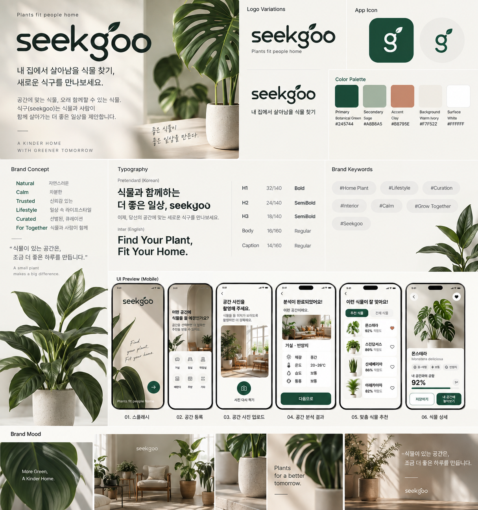

# 식구 (seekgoo) — Prototype PRD

> Version: 0.7 (2026-09-18, §54 우선)  
> Product type: Mobile-first functional prototype  
> Primary implementation target: HTML5 + CSS3 + Vanilla JavaScript (ES6+)  
> Deployment target: Vercel
> Production target: Mobile Web, viewport width ≤ 430px  
> Prototype language: Korean  
> Purpose: Validate the end-to-end UX before formal user research and high-fidelity production design.

---

## 0. Mandatory Session Protocol for Codex / Coding Agents

**This section is mandatory and has the highest implementation priority.**

Before writing, editing, refactoring, or generating implementation code in **every new coding session**, the coding agent must:

1. Open and read this entire `seekgoo-PRD.md` before implementation begins.
2. Treat this PRD as the source of truth for product scope, UX flow, branding, technical stack, responsive rules, states, and implementation constraints.
3. Review the latest seekgoo brand moodboard referenced in this PRD before making UI decisions.
4. Check that the requested task does not conflict with the PRD.
5. Continue the existing information architecture, naming, state model, and visual language rather than independently redesigning the service.
6. If implementation reality requires a deviation, choose the smallest reasonable deviation and document it clearly instead of silently changing product intent.
7. Do not add frameworks, backend services, AI APIs, AR libraries, authentication, commerce, or unrelated features unless this PRD is explicitly revised.

### Required implementation stack

- HTML5
- CSS3
- Vanilla JavaScript (ES6+)
- Browser-native APIs where practical
- localStorage for prototype persistence
- Vercel for deployment

**Do not use React, Vue, Svelte, Angular, or another front-end framework for this version.**

---

## 1. Product Overview

### 1.1 Product name
**식구 (seekgoo)** — final product name

**Naming concept:** `seek + goo(구)` — 내 집에서 함께 살아갈 식물을 찾는다는 의미와, 집에서 함께 사는 존재인 ‘식구’라는 한국어 의미를 함께 담는다.

### 1.2 One-line concept
**내 집에서 살아남을 식물 찾기!**  
공간 환경 × 나의 관리 성향을 기반으로 우리 집에서 함께 살아갈 새로운 ‘식구’를 찾고, 실제 내 공간 사진에 식물과 화분을 미리 배치해보며 선택을 돕는 식물 큐레이션 서비스.

### 1.3 Core user value

seekgoo supports two questions that beginner plant owners have before buying a plant.

1. **Grow Fit — 우리 집에서 잘 자랄까?**
   - 공간의 채광/환경
   - 사용자의 식물 관리 경험 및 성향
   - 식물별 관리 조건

2. **Style Fit — 우리 집에 잘 어울릴까?**
   - 사용자가 등록한 실제 공간 사진
   - 식물 종류
   - 화분 색상/재질
   - 간단한 크기 및 위치 조절

The prototype should help a user move from uncertainty to a shortlist they feel comfortable choosing.

---

## 2. Why This Prototype Exists

This is **not a production-ready AI plant service**.

The goal is to turn the current product idea into a working experience and test whether the proposed flow makes sense before investing in deeper research, visual design, backend systems, AI, or AR.

### 2.1 Questions to validate

The prototype should help answer:

1. Does “register my space first, then receive plant recommendations” feel natural?
2. Is the path from space registration to recommendation too long or complicated?
3. Do users understand the mock space analysis result?
4. Do recommendation reasons make the recommendations feel more trustworthy/useful?
5. Are search/filter and comparison useful after personalized recommendations?
6. Does “place it in my space” help users decide between plants?
7. Is choosing the plant and pot separately understandable or cumbersome?
8. At what point do users want to save a plant or combination?
9. Which screens/features feel unnecessary after using the whole flow?

---

## 3. Problem Statement

Beginner plant owners often choose plants based on appearance or popularity before understanding whether the plant matches their home environment and their ability to care for it.

They may also understand that a plant is environmentally suitable but still hesitate because they cannot imagine how the plant will look in their actual room.

### Problem framing

> How might we help plant beginners choose a plant that fits both their home environment and their ability to care for it, while also helping them preview whether it visually suits their space before purchase?

---

## 4. Target Persona — Hypothesis

> This persona is a hypothesis for prototype development. It must not be presented as a research-validated persona.

### “식물을 키우고 싶지만 또 죽일까 걱정되는 초보자”

- 20s–30s
- Interested in home/interior styling
- Wants plants at home but has little plant knowledge
- Has never grown plants or has failed before
- Does not confidently understand terms such as 양지/반양지/반음지
- Often chooses plants based on appearance
- Cannot spend a lot of time on plant maintenance
- Wants reassurance before purchasing another plant
- Wants to know both:
  - “Can I keep this alive?”
  - “Will this look good in my room?”

---

## 5. Product Principles

1. **Beginner-first language**
   - Avoid unexplained specialist terminology.
   - Explain “반양지” with simple descriptions.

2. **Explain recommendations**
   - Do not show only a match percentage.
   - Always show why a plant is recommended.

3. **AI should not be faked**
   - The prototype may simulate analysis.
   - UI must not claim that a real AI model has analyzed the room.

4. **User correction over false certainty**
   - Space analysis results must be editable.

5. **Decision support, not plant encyclopedia**
   - Prioritize information needed to choose a plant.

6. **One continuous experience**
   - The room photo uploaded at the beginning should return later in the Visualizer.

---

# 6. Scope

## 6.1 Core Functional MVP

The following should actually work in the browser:

- Home
- Space creation
- Room image upload + preview
- Mock space analysis
- Editable analysis result
- Plant-care preference questionnaire
- Rule-based personalized recommendation
- Plant search
- Plant filters
- Plant detail
- Plant comparison
- Plant save/favorite
- My Space dashboard
- Persistence with localStorage

## 6.2 Concept Prototype — Plant + Pot Visualizer

This feature should be interactive but deliberately limited.

It should support:

- Reuse of the room photo uploaded during space registration
- Select a plant
- Select a pot
- Display transparent plant/pot assets over the room image
- Change plant
- Change pot
- Move the placed plant composition
- Adjust size
- Save the selected combination

### Explicit limitation

The Visualizer is **NOT**:

- AI image generation
- Real image compositing
- Computer vision
- Depth detection
- Perspective correction
- Floor detection
- Real-world scale measurement
- AR camera placement

Implementation should simulate placement using layered assets.

## 6.3 Out of Scope / Future Features

Do not implement in v0.3:

- Login/signup
- Backend/database
- Payments or commerce
- Push notifications
- Plant watering notifications
- Fertilizer notifications
- Seasonal watering algorithm
- Plant adaptation test
- Community
- Reviews
- Real AI room analysis
- Real generative image compositing
- AR
- E-commerce integration
- Plant purchase
- Brand-specific pot catalog

---

# 7. Information Architecture

Recommended primary navigation after onboarding:

### Home
- Current space summary
- Personalized recommendation preview
- Recently saved plants/combinations

### Explore
- Search
- Filters
- All plants
- Recommended plants

### Saved
- Saved plants
- Saved room combinations

### My Space
- Registered space
- Analysis result
- Recommendation summary
- Edit space

For the first prototype, only one registered space is required. Data structures should still use a `spaceId` so multiple spaces can be added later.

---

# 8. Primary User Flow

```text
Home
  ↓
Register Space
  ↓
Upload Room Photo
  ↓
Mock Analysis Loading
  ↓
Space Analysis Result
  ↓
Care Preference Questionnaire
  ↓
Personalized Recommendations
  ├── Explore / Search / Filter
  └── Plant Detail
          ├── Save
          ├── Compare
          └── Place in My Space
                    ↓
              Plant Visualizer
                    ↓
              Select Plant
                    ↓
              Select / Change Pot
                    ↓
              Move / Resize
                    ↓
              Save Combination
                    ↓
                My Space
```

---

# 9. Screen Inventory

Target: approximately **14 primary screens/states**.

1. Home
2. Space Type Selection
3. Room Photo Upload
4. Mock Space Analysis Loading
5. Space Analysis Result
6. Care Preference Questionnaire
7. Personalized Recommendation Result
8. Explore / Search / Filter
9. Plant Detail
10. Plant Comparison
11. Plant Visualizer
12. Pot Selection / Visualizer Controls
13. Save Combination Success / Saved Combination
14. My Space / Saved Dashboard

Some screens may be implemented as routes, drawers, bottom sheets, dialogs, or state variations rather than separate pages.

---

# 10. Detailed Screen Requirements

## 10.1 Screen 01 — Home

### First-time state

Headline:
> 식물 둘 공간부터 알아볼까요?

Supporting copy:
> 우리 집 환경을 확인하고 잘 맞는 식물을 찾아보세요.

Primary CTA:
**내 공간 등록하기**

### Returning state

Show:

- Space photo thumbnail
- Space name
- Light condition
- Number of recommended plants
- Saved plant count
- Saved combination count
- 2–3 recommended plant cards

Primary actions:

- 추천 식물 보기
- 내 공간 보기
- 식물 탐색하기

### Empty state
No space exists → prioritize registration CTA.

---

## 10.2 Screen 02 — Space Type Selection

Question:
> 식물을 어디에 둘 예정인가요?

Options:

- 거실
- 침실
- 작업실
- 베란다
- 기타

Allow custom space name for 기타.

Primary CTA:
**다음**

Store:
`space.name`, `space.type`

---

## 10.3 Screen 03 — Room Photo Upload

Headline:
> 식물을 놓을 위치가 보이도록 촬영해주세요.

Guide:
> 창문과 식물을 둘 위치가 함께 보이면 공간을 이해하기 쉬워요.

Actions:

- 사진 선택
- Camera input where supported
- Replace image
- Remove image

After upload:

- Show full preview
- Allow continue

Primary CTA:
**이 사진으로 분석하기**

### Technical requirement

The selected room image must remain available later for the Plant Visualizer.

For prototype simplicity:

- Use `FileReader` / object URL for immediate preview.
- If persistence across refresh is required, resize/compress and store as data URL in localStorage.
- If storage size becomes a problem, gracefully keep it session-only and document the limitation.

---

## 10.4 Screen 04 — Mock Space Analysis Loading

No real AI request.

Simulate progress for approximately 2–3 seconds.

Example progress states:

1. 사진을 확인하고 있어요
2. 채광 환경을 살펴보고 있어요
3. 공간 조건을 정리하고 있어요
4. 식물을 찾을 준비가 되었어요 🌱

Use:

- progress indicator
- subtle motion
- no fake technical claims such as “AI confidence 98%”

After completion:
navigate automatically to analysis result.

---

## 10.5 Screen 05 — Space Analysis Result

Example result:

> 나의 거실은 **반양지 공간**에 가까워요.

Cards:

- ☀️ 채광: 중간
- 🪟 창문과 거리: 약 2m
- 🌡️ 실내 환경: 20–26°C
- 💨 통풍: 보통

Plain-language explanation:

> 강한 직사광선보다 밝은 간접광을 좋아하는 식물이 잘 맞는 공간이에요.

### Required interaction: Edit analysis

Button:
**결과 수정하기**

Editable fields:

- Light: 양지 / 반양지 / 반음지 / 음지
- Ventilation: 낮음 / 보통 / 좋음
- Approximate room temperature: optional
- Window distance: 가까움 / 보통 / 멂

Primary CTA:
**내 관리 성향 알아보기**

---

# 11. Care Preference Questionnaire

## 11.1 Screen 06

Use one question per state or a compact multi-step form.

Show progress:
`1 / 4`, `2 / 4`, etc.

### Q1 — Experience

> 식물을 키워본 적이 있나요?

- 처음이에요
- 몇 번 실패했어요
- 어느 정도 익숙해요

### Q2 — Care frequency

> 식물을 얼마나 자주 돌볼 수 있나요?

- 거의 신경 못 써요
- 주 1회 정도
- 자주 돌볼 수 있어요

### Q3 — Main concern

> 식물을 키울 때 가장 걱정되는 건 무엇인가요?

- 물주기
- 햇빛
- 벌레
- 관리 난이도

### Q4 — Preferred size

> 어떤 크기의 식물을 원하나요?

- 소형
- 중형
- 대형
- 상관없어요

Final CTA:
**내 식물 추천받기**

Store answers in `careProfile`.

---

# 12. Recommendation System

## 12.1 Goal

The recommendation system does not need machine learning.

It should be a transparent rule-based scoring system using mock plant data.

## 12.2 Recommendation dimensions

Suggested score: 0–100.

Weights:

- Light compatibility: 40
- Difficulty vs user experience: 25
- Care frequency compatibility: 20
- Preferred size: 15

These weights are prototype defaults and may change after testing.

### Example

User:
- 반양지
- 몇 번 실패
- 거의 신경 못 씀
- 중형

Plant:
- 스킨답서스
- supports 반양지
- easy
- drought tolerant
- medium

Possible result:
`92%`

## 12.3 Recommendation explanation

Do not display only the score.

Generate 2–3 explanation bullets from matched attributes.

Example:

- 반양지 공간에 잘 맞아요
- 물을 조금 늦게 줘도 비교적 괜찮아요
- 초보자가 키우기 쉬운 편이에요

If there is a mismatch, show one gentle caution:

- 물주기에 조금 더 신경 써주세요

---

# 13. Screen 07 — Personalized Recommendation Result

Headline:
> 거실에서 잘 자랄 식물을 찾았어요 🌿

Supporting copy:
> 공간 환경과 관리 성향을 함께 고려했어요.

Plant cards show:

- Image
- Korean name
- Scientific/common English name optionally
- Match score
- Difficulty
- Size
- 1–2 recommendation reasons
- Save icon

Sort:
highest match first.

Primary card action:
open Plant Detail.

Secondary:
**전체 식물 탐색하기**

---

# 14. Screen 08 — Explore / Search / Filter

## Search

Search plant names.

Search should work for:

- Korean name
- English/common name where available

## Filters

### Light
- 양지
- 반양지
- 반음지
- 음지

### Difficulty
- 매우 쉬움
- 쉬움
- 보통
- 어려움

### Size
- 소형
- 중형
- 대형

### Features
Examples:
- 건조에 강함
- 공기정화
- 반려동물 안전
- 습도에 강함

## Interaction requirements

- Multi-select filters
- Active filter chips
- Result count
- Clear all
- Empty state when no results
- Filter state should persist while navigating to detail and back

---

# 15. Plant Mock Data

Create approximately **12–18 plants** for the first prototype.

Suggested initial plants:

- 스킨답서스
- 산세베리아
- 몬스테라
- 고무나무
- 아레카야자
- 테이블야자
- 스파티필름
- 필로덴드론
- 금전수
- 아이비
- 페페로미아
- 행운목

The dataset is prototype content. Avoid presenting uncertain care facts as professional horticultural advice.

## Suggested schema

```ts
type Plant = {
  id: string;
  nameKo: string;
  nameEn: string;
  image: string;
  transparentAsset?: string;

  light: Array<"sunny" | "partial-sun" | "partial-shade" | "shade">;
  difficulty: "very-easy" | "easy" | "medium" | "hard";
  careFrequency: "low" | "medium" | "high";
  sizes: Array<"small" | "medium" | "large">;

  features: string[];
  petSafe?: boolean;

  wateringLabel: string;
  lightLabel: string;
  sizeLabel: string;

  shortDescription: string;
  careTips: string[];
  cautions: string[];
};
```

---

# 16. Screen 09 — Plant Detail

Required sections:

### Hero
- Plant image
- Plant name
- Save button

### Basic information
- Difficulty
- Recommended light
- Watering level
- Available size

### My Space Match

Example:

> 내 거실과 **89% 잘 맞아요**

Show:
- ✓ 채광 조건이 잘 맞아요
- ✓ 선호한 식물 크기와 맞아요
- △ 물주기에 조금 신경 써주세요

### Care summary
Keep concise.

### Main actions

1. `♡ 저장`
2. `⇄ 비교하기`
3. **`✨ 내 공간에 놓아보기`**

The Visualizer CTA should be visually prominent.

---

# 17. Screen 10 — Plant Comparison

Maximum:
**3 plants**

Comparison attributes:

- My-space match score
- Difficulty
- Light
- Care frequency / watering
- Size
- Relevant features
- Personal-care compatibility

Interaction:

- Add/remove plant
- Prevent adding more than 3
- Empty comparison slot
- Open detail
- Place selected plant in my space

Responsive behavior:
mobile horizontal cards or horizontally scrollable comparison columns.

---

# 18. Saved Plants

Users can save/unsave plants.

Saved state should:

- update immediately
- persist via localStorage
- be visible on cards and detail
- appear in Saved / My Space

No authentication.

---

# 19. Plant + Pot Visualizer

## 19.1 Product purpose

The Visualizer answers:

> “환경적으로는 잘 맞는다는데, 실제 우리 집에 놓으면 어울릴까?”

It is a **Style Fit decision-support concept**, not a real AR implementation.

## 19.2 Entry points

Primary:
Plant Detail → **내 공간에 놓아보기**

Secondary:
Comparison → choose a plant → **내 공간에 놓아보기**

## 19.3 Room image

Use the room photo uploaded during onboarding.

If no room photo exists:
show an empty state and CTA to register a space.

---

# 20. Screen 11 — Visualizer Main Screen

Layout:

```text
[Top App Bar]

[Room photo / visualizer canvas]
    [Plant layer]
    [Pot layer]

[Selected combination summary]

[Plant] [Pot] tabs

[Size controls]
[Reset position]

[Save combination CTA]
```

### Initial behavior

If entered from a Plant Detail page:
- preselect that plant
- use a default pot

If entered from My Space:
- use the most recently selected plant or prompt user to choose

---

# 21. Visualizer Technical Model

### Important implementation instruction

**Do not call an image-generation API.  
Do not implement AR.  
Do not claim that the image is AI-generated.**

The visualizer should be implemented as layered 2D assets.

Conceptual structure:

```text
Visualizer Canvas
├── Room Background Image
└── Transformable Composition
    ├── Plant transparent PNG/SVG
    └── Pot transparent PNG/SVG
```

Recommended implementation:

- Container with `position: relative`
- Room image fills container
- Plant/pot composition uses `position: absolute`
- Transform with CSS:
  - `translate(x, y)`
  - `scale(value)`
- Pointer events for drag
- Buttons or slider for size

### v0.3 controls

Required:
- Drag position
- Increase size
- Decrease size
- Reset

Not required:
- rotation
- perspective
- 3D
- pinch zoom
- floor snapping
- occlusion

---

# 22. Plant Selection in Visualizer

Show horizontal carousel or bottom sheet.

Tabs:
- 추천 식물
- 저장한 식물
- 전체 식물

Each option shows:
- thumbnail
- name
- match score when available

On selection:
- replace plant asset immediately
- keep room image
- keep approximate scale/position where reasonable

---

# 23. Screen 12 — Pot Selection

Pot selection can be a bottom sheet or Visualizer tab, not necessarily a separate route.

## Filters/categories

### Color
- White
- Beige
- Terracotta
- Gray
- Black

### Material
- Ceramic
- Terracotta
- Stone
- Basket

For v0.3, create approximately **6–8 pot assets**.

Suggested pot data:

```ts
type Pot = {
  id: string;
  name: string;
  color: "white" | "beige" | "terracotta" | "gray" | "black";
  material: "ceramic" | "terracotta" | "stone" | "basket";
  image: string;
};
```

On pot selection:
- replace pot layer immediately.

---

# 24. Visualizer Asset Strategy

Perfect photorealistic compositing is not required.

Priority:
1. interaction works
2. assets are visually consistent
3. plant/pot switching is obvious
4. user understands the concept

### Asset requirements

Plants:
- transparent background
- consistent framing
- roughly similar perspective
- plant and pot should be separable where possible

Pots:
- transparent background
- consistent front-facing perspective

If separate plant/pot layering looks visually broken:
use a fallback implementation with pre-composed plant+pot transparent assets for a small number of combinations.

Document this compromise rather than adding AI.

---

# 25. Screen 13 — Save Combination

CTA:
**이 조합 저장하기**

Saved object contains:

- spaceId
- plantId
- potId
- x position
- y position
- scale
- createdAt

Success feedback:

> 조합을 저장했어요 🌿

Actions:

- 저장한 조합 보기
- 다른 조합 만들어보기
- 식물 상세로 돌아가기

---

# 26. Screen 14 — My Space Dashboard

Headline:
> 나의 공간

Space card:

- Room image
- Space name
- Light condition
- Recommended plant count
- Saved plant count
- Saved combination count

Sections:

### 내 공간과 잘 맞는 식물
2–4 recommendation cards

### 저장한 식물
Saved plant cards

### 저장한 조합
Room + plant + pot combinations

Actions:

- 공간 분석 수정
- 식물 탐색
- 새 조합 만들기

---

# 27. Mock Space Analysis Logic

No image analysis is performed.

After upload, assign a deterministic or fixed demo result.

Recommended default:

```ts
{
  light: "partial-sun",
  ventilation: "medium",
  windowDistance: "medium",
  temperature: "20–26°C"
}
```

For a more interactive prototype, optionally allow one of 3 demo analysis presets.

The UI must always allow manual editing.

---

# 28. State Model

Suggested application state:

```ts
type AppState = {
  space: Space | null;
  careProfile: CareProfile | null;

  savedPlantIds: string[];
  comparePlantIds: string[];
  savedCombinations: SavedCombination[];

  exploreFilters: ExploreFilters;
};
```

### Space

```ts
type Space = {
  id: string;
  name: string;
  type: string;

  imageDataUrl?: string;

  analysis: {
    light: string;
    ventilation: string;
    windowDistance: string;
    temperature?: string;
  };

  analysisCompleted: boolean;
};
```

### Care profile

```ts
type CareProfile = {
  experience: "first" | "failed-before" | "experienced";
  careFrequency: "low" | "medium" | "high";
  mainConcern: "watering" | "light" | "pests" | "difficulty";
  preferredSize: "small" | "medium" | "large" | "any";
};
```

### Saved combination

```ts
type SavedCombination = {
  id: string;
  spaceId: string;
  plantId: string;
  potId: string;

  transform: {
    x: number;
    y: number;
    scale: number;
  };

  createdAt: string;
};
```

---

# 29. Persistence

Use `localStorage`.

Suggested keys:

```text
seekgoo-space
seekgoo-care-profile
seekgoo-saved-plants
seekgoo-compare
seekgoo-saved-combinations
```

Provide a development-only reset action:

**프로토타입 데이터 초기화**

This may be placed in a small settings/debug section.

---

# 30. Loading / Empty / Success / Error States

The prototype should not show only happy paths.

## Required loading states
- Mock room analysis
- Initial route/data hydration if necessary

## Required empty states
- No registered space
- No saved plants
- No comparison plants
- No saved combinations
- No search/filter results
- Visualizer without room photo

## Required success feedback
- Space saved
- Plant saved
- Plant removed from saved
- Added to comparison
- Combination saved
- Analysis edited

## Required validation/error states
- Continue without photo
- Missing space name
- Comparison > 3 plants
- Unsupported image upload
- localStorage image too large if encountered

Use friendly, concise Korean copy.

---

# 31. Navigation

Recommended mobile bottom navigation after onboarding:

1. **홈**
2. **탐색**
3. **저장**
4. **내 공간**

Do not add a center “+” action unless later testing shows a need.

During onboarding/questionnaire:
hide bottom navigation to maintain focus.

---

# 32. Design Direction

### Personality
- Calm
- Beginner-friendly
- Warm
- Trustworthy
- Lightly playful
- Not childish

### Visual direction
- Botanical but modern
- Generous whitespace
- Rounded cards
- Clear hierarchy
- Large plant photography
- Soft feedback motion

### Avoid
- Overly decorative botanical patterns
- Too many green tones
- Dense encyclopedia layouts
- Fake AI dashboards
- Excessive gradients
- Gamification that distracts from selection

### Reference image instruction for Codex

The final approved moodboard is `assets/brand/seekgoo-brand-moodboard.png`.

If an additional visual concept board is provided with this PRD:

> Use the reference image only for overall mood, visual hierarchy, botanical tone, and conceptual direction. Do not reproduce it pixel-for-pixel. The UX requirements, states, navigation, and component behavior in this PRD take priority.

---

# 32.1 Final Brand Moodboard — Source of Truth

The following image is the **final approved seekgoo brand moodboard** for Prototype v0.3.



If the image is supplied separately to Codex, place it at:

```text
assets/brand/seekgoo-brand-moodboard.png
```

### Moodboard rules

Use the moodboard as the primary visual reference for:

- `seekgoo` lowercase English wordmark
- the custom **g + leaf** motif
- app icon using the **g + leaf** symbol
- plant-first, object-focused imagery
- calm editorial/lifestyle composition
- generous warm negative space
- botanical green + sage + clay + warm ivory palette
- restrained rounded UI
- large plant imagery and quiet information hierarchy
- interior/lifestyle photography with natural light and shadow

The product should feel **curated, calm, natural, trustworthy, and lifestyle-oriented** rather than cute, childish, game-like, or overly decorative.

### Logo direction

Primary logo:
- lowercase `seekgoo`
- custom leaf attached to the `g`
- no mascot
- no cartoon plant icon beside the wordmark

App icon:
- simplified lowercase `g` + leaf symbol
- may appear on botanical green or warm neutral background

### Visual priority

In UI screens, the plant should often behave like an **object/product hero**, not a small decorative thumbnail.

Prefer:
- larger isolated plant imagery
- generous breathing room
- clean cards
- soft interior backgrounds
- clear hierarchy
- restrained labels/chips

Avoid:
- dense green dashboards
- excessive icons
- cute illustrations
- bubbly typography
- excessive gradients
- decorative plant stickers
- visual clutter around plant photography

---

# 33. Design Tokens — Starting Point

Codex may adjust exact values for accessibility and visual consistency.

## Spacing
Use an 8px-based system.

Examples:
- 4
- 8
- 12
- 16
- 24
- 32
- 40

## Radius
- Small controls: 8–10px
- Cards: 16px
- Large panels/bottom sheets: 20–24px
- Pills/chips: full radius

## Typography
Use a Korean-friendly sans-serif system stack.

Suggested:
`Pretendard, "Noto Sans KR", system-ui, sans-serif`

If Pretendard is not bundled, use system/Noto fallback rather than blocking implementation.

## Color direction
Use semantic tokens rather than hard-coded colors throughout components:

```text
--color-primary
--color-primary-soft
--color-background
--color-surface
--color-text-primary
--color-text-secondary
--color-border
--color-success
--color-warning
--color-error
```

Primary should feel botanical and trustworthy.

Ensure accessible text contrast.

---

# 34. Core Components

Build reusable components rather than page-specific duplicates.

Required:

- AppBar
- BottomNavigation
- PrimaryButton
- SecondaryButton
- IconButton
- PlantCard
- SpaceCard
- MatchScore
- RecommendationReason
- FilterChip
- SegmentedControl
- SearchInput
- InfoMetricCard
- ProgressIndicator
- EmptyState
- Toast / Snackbar
- BottomSheet or Modal
- CompareTray
- PlantSelector
- PotSelector
- VisualizerCanvas
- SaveCombinationCard

---

# 35. Interaction Guidelines

## Save
Heart state updates immediately.

## Compare
When plant is added:
show persistent compare tray:
> 비교 2/3

Tap tray → Comparison.

## Filter
Update results immediately after filter selection.

## Questionnaire
Use clear selected states and progress.

## Visualizer
- Drag should feel direct.
- Plant/pot changes should update without page reload.
- Size controls should have visible feedback.
- Reset should restore centered default placement.

## Motion
Use restrained transitions:
- 150–250ms for UI state changes
- simple fade/slide
- avoid decorative animation that slows task completion

Respect `prefers-reduced-motion`.

---

# 36. Mobile Web Production Requirements

This prototype is produced as **mobile web only** for viewport widths of **430px or less**.

### Required QA widths

- 360px
- 375px
- 390px
- 412px
- 430px

### Layout rules

- Optimize every core flow for ≤430px first.
- Use a fluid app width with `max-width: 430px`.
- On wider desktop browsers, center the mobile app shell rather than creating a separate desktop product.
- Do not create desktop-specific sidebars, navigation, dashboards, or alternate information architecture in v0.3.
- No unintended horizontal page scrolling.
- Horizontal scrolling is allowed only for intentional components such as plant carousels or comparison columns.
- Fixed bottom navigation / bottom CTA must not cover scrollable content.
- Consider mobile safe-area insets.
- Test the deployed Vercel build on an actual mobile browser.

Recommended shell:

```css
.seekgoo-app {
  width: 100%;
  max-width: 430px;
  min-height: 100dvh;
  margin: 0 auto;
}
```

The complete flow must remain usable at 360px without clipped primary actions, broken cards, or unreadable text.

---

# 37. Accessibility

Minimum expectations:

- Semantic HTML
- Keyboard-accessible controls
- Visible focus states
- Buttons must have accessible labels
- Do not communicate match/caution using color only
- Minimum comfortable touch target ~44px
- Sufficient contrast
- Uploaded room image should have descriptive alt text where appropriate
- Respect reduced motion

---

# 38. Suggested HTML/CSS/JavaScript Architecture

Required stack:

- HTML5
- CSS3
- Vanilla JavaScript (ES6+)
- No front-end framework
- No TypeScript requirement
- No backend
- No authentication

Use browser-native APIs and readable modules. Avoid large dependencies unless absolutely necessary.

Suggested structure:

```text
seekgoo/
├── index.html
├── css/
│   ├── tokens.css
│   ├── base.css
│   ├── components.css
│   ├── screens.css
│   └── responsive.css
├── js/
│   ├── app.js
│   ├── router.js
│   ├── state.js
│   ├── storage.js
│   ├── data/
│   │   ├── plants.js
│   │   └── pots.js
│   ├── services/
│   │   └── recommendation.js
│   ├── components/
│   │   ├── plant-card.js
│   │   ├── bottom-nav.js
│   │   ├── filter-chip.js
│   │   ├── compare-tray.js
│   │   └── visualizer.js
│   └── screens/
│       ├── home.js
│       ├── space-setup.js
│       ├── photo-upload.js
│       ├── analysis.js
│       ├── questionnaire.js
│       ├── recommendations.js
│       ├── explore.js
│       ├── plant-detail.js
│       ├── compare.js
│       ├── visualizer.js
│       ├── saved.js
│       └── my-space.js
└── assets/
    ├── brand/
    │   └── seekgoo-brand-moodboard.png
    ├── plants/
    ├── pots/
    └── demo/
```

### Architecture principles

- Use semantic HTML.
- Use CSS custom properties for design tokens.
- Use reusable JavaScript rendering functions/modules rather than duplicating markup logic.
- Keep application state predictable and centralized.
- Keep localStorage access isolated in `storage.js`.
- Keep recommendation scoring separate from DOM rendering.
- Keep visualizer transform logic isolated from screen UI logic.
- Do not convert the project to React or another framework unless this PRD is explicitly revised.

---

# 39. Recommended Routes

Example:

```text
/
 /space/new
 /space/photo
 /space/analyzing
 /space/result
 /profile/care
 /recommendations
 /explore
 /plants/:plantId
 /compare
 /visualizer/:plantId?
 /saved
 /my-space
```

Routes may use the History API or hash-based routing. Prevent obviously broken routes where prerequisites are missing.

Example:
`/recommendations` without space/care profile → redirect to required setup.

---

# 40. Recommendation Utility

Keep business logic separate from UI.

Suggested function:

```ts
getPlantMatch(
  plant: Plant,
  space: Space,
  profile: CareProfile
): {
  score: number;
  reasons: string[];
  cautions: string[];
}
```

Requirements:

- deterministic
- easy to inspect
- no external API
- no random score generation
- score must reflect actual mock attributes

---

# 41. Prototype Content Rules

Use realistic Korean UI copy.

Avoid lorem ipsum.

Keep text concise enough for mobile.

Important labels should be consistent:

- 내 공간
- 공간 분석
- 관리 성향
- 추천 식물
- 내 공간 적합도
- 저장
- 비교
- 내 공간에 놓아보기
- 식물 선택
- 화분 선택
- 이 조합 저장하기

---

# 42. Acceptance Criteria

The prototype is ready for first UX review when all conditions below are met.

## End-to-end
- [ ] A first-time user can start from Home.
- [ ] User can register a space.
- [ ] User can upload a room image.
- [ ] Mock analysis completes and displays a result.
- [ ] User can edit the analysis result.
- [ ] User can complete 4 care-profile questions.
- [ ] Recommendations are generated from actual rule-based logic.
- [ ] User can open a plant detail.
- [ ] User can search/filter plants.
- [ ] User can save/unsave plants.
- [ ] User can compare up to 3 plants.
- [ ] User can open the Visualizer from a plant.
- [ ] The originally uploaded room photo is used in the Visualizer.
- [ ] User can switch plants.
- [ ] User can switch pots.
- [ ] User can move and resize the composition.
- [ ] User can save a plant+pot+placement combination.
- [ ] Saved data appears in My Space/Saved.
- [ ] Core state persists after refresh where technically reasonable.

## UX
- [ ] Every primary screen has one clear primary action.
- [ ] Back navigation works.
- [ ] Empty states exist.
- [ ] Success feedback exists.
- [ ] No feature claims real AI/AR.
- [ ] Mobile layout works at 360px width.
- [ ] Interactive elements have visible selected/pressed states.

---

# 43. Codex Implementation Order

Implement in this order to reduce rework.

## Phase 1 — Foundation
1. Create the plain HTML5/CSS3/Vanilla JavaScript project structure
2. Add lightweight client-side navigation/routing
3. Create design tokens
4. Create base layout and navigation
5. Add mock plant/pot data
6. Add localStorage utilities

## Phase 2 — Core onboarding
7. Home
8. Space type selection
9. Room image upload
10. Mock analysis loading
11. Editable analysis result
12. Care questionnaire

## Phase 3 — Decision support
13. Recommendation scoring utility
14. Recommendation page
15. Explore/search/filter
16. Plant detail
17. Save state
18. Comparison

## Phase 4 — Visualizer
19. Visualizer canvas
20. Reuse room image
21. Plant selection
22. Pot selection
23. Drag position
24. Scale controls
25. Save combination

## Phase 5 — Dashboard & polish
26. Saved page
27. My Space dashboard
28. Empty/error/success states
29. Responsive QA
30. Accessibility pass
31. Vercel build/deploy readiness

Do not begin with visual polish before the complete flow works.

---

# 44. UX Review Checklist After Vercel Deployment

Use the deployed prototype on an actual phone.

Record observations, not only opinions.

### Onboarding
- Do I understand why I need to register my space?
- Does asking for a room photo feel reasonable?
- Is the photo guide understandable?
- Does mock analysis feel misleading?

### Analysis
- Do I understand “반양지”?
- Is there enough information to trust the result?
- Do I notice that I can edit the result?

### Care profile
- Are 4 questions short enough?
- Does any question feel irrelevant?
- Does the recommendation feel worth the effort?

### Recommendations
- Do I understand why each plant was recommended?
- Is match percentage useful or distracting?
- Do I want to explore beyond the recommended list?

### Detail & comparison
- What information do I actually need before deciding?
- Is comparison useful?
- Are there too many attributes?

### Visualizer
- Does seeing the plant in my room change my preference?
- Is switching plants easy?
- Is switching pots useful?
- Is dragging/resizing understandable?
- Does the mock placement feel sufficient to communicate the concept?
- Would this feature still be valuable without real AR?

### Saving
- Do I want to save the plant, the combination, or both?
- Is the difference between “saved plant” and “saved combination” clear?

### Overall
- Which screen feels unnecessary?
- Where does the flow feel too long?
- What did I expect to happen but could not do?
- What should be tested in user interviews next?

---

# 45. Research Handoff After Prototype v0.3

Do not treat prototype assumptions as findings.

After the first internal prototype review:

1. Identify unclear or unnecessary steps.
2. Revise the flow in the next PRD revision.
3. Create research hypotheses.
4. Recruit beginner plant owners / people with plant-failure experience.
5. Conduct interviews about existing behavior before showing the prototype.
6. Test the prototype only after understanding current behavior.
7. Compare research findings against assumptions in this PRD.
8. Update:
   - problem definition
   - persona
   - feature priority
   - recommendation logic
   - IA
   - screen flow

---

# 46. Future Product Direction

If the core concept proves useful, future versions may evolve from mock placement to richer assistance.

Possible progression:

```text
Space analysis
→ Plant recommendation
→ Visual fit preview
→ Purchase decision
→ Register owned plant
→ Adaptation check
→ Ongoing plant care
```

Potential advanced Visualizer:

- Real AI room segmentation
- Floor/surface detection
- Depth/perspective estimation
- Photorealistic plant compositing
- Real-size estimation
- Live AR placement
- Real product catalog for pots/plants

These are **future possibilities**, not promises for the MVP.

---

# 47. Definition of Success for v0.3

v0.3 is successful if it allows the designer to answer:

> “Does this product flow feel coherent enough to justify deeper user research and further design work?”

Success is **not** measured by:
- number of screens
- visual polish
- AI sophistication
- production architecture

Success is measured by whether the prototype makes the product idea tangible enough to expose weak assumptions, confusing transitions, unnecessary features, and promising interactions.

---

## Final implementation note for Codex

Build the simplest reliable version of the full experience first.

Prioritize:

1. Working end-to-end flow
2. Clear state changes
3. Reusable components
4. Realistic mock data
5. Mobile usability
6. Transparent prototype limitations

Do not add authentication, backend services, AI APIs, AR libraries, commerce, or unrelated features unless this PRD is explicitly revised.

# 48. v0.3 확정 사항 — 2026-09-16

이 절은 사용자의 후속 결정과 위임받아 정의한 추천 규칙을 반영한다. 앞선 절과 충돌하면 이 절을 우선한다. 구현 에이전트 지침은 구현 요청을 받은 경우에만 적용하며, 이 문서 자체를 구현·배포 요청으로 해석하지 않는다.

## 48.1 모의 공간 분석과 사용자 확인

실제 사진 분석, 온도 측정, AI 호출은 수행하지 않는다. 스캔 느낌의 진행 연출은 가능하나, 시작 전부터 모의 분석임을 표시한다.

- 사진 화면 안내: “프로토타입에서는 실제 AI 분석 대신 예시 공간 정보를 보여드려요. 결과를 확인하고 우리 집에 맞게 수정해주세요.”
- 시작 버튼: “예시 분석 시작하기”
- 진행 화면: “공간 정보 예시를 준비하고 있어요” + “실제 사진 분석은 진행되지 않아요.”
- 결과 제목: “공간 정보를 확인해주세요”
- 결과 배지: “모의 분석 · 확인 필요”
- 결과 안내: “아래는 사진에서 측정한 확정 결과가 아닌 예시 정보예요. 실제 공간과 다른 부분이 있나요?”
- 기본 채광: 반양지. 설명: “강한 직사광선보다 밝은 간접광이 드는 공간을 뜻해요.”
- 주요 버튼: “이 정보로 계속하기”
- 보조 버튼: “수정할게요”
- 수정 화면: 채광 필수 선택, 온도 선택 입력. 저장 후 결과 화면으로 돌아와 확인 가능.
- 사용자가 결과를 확인해야 관리 성향 설문으로 이동한다.

사진으로 온도나 창문 거리를 측정했다고 표시하지 않는다. 온도는 초기값 없이 “모름 / 입력 안 함”을 허용하고, 사용자가 알고 있을 때만 숫자(°C)로 입력한다. 추천 점수에는 사용하지 않는다. 통풍·창문 거리 입력 및 분석 결과 항목은 제거하고 식물 상세의 정성적 관리 설명으로 옮긴다. 예: “밝은 간접광이 드는 곳에 두고 강한 직사광선은 피해 주세요.” 식물별 데이터에 따라 설명을 다르게 하며 모든 식물에 동일한 거리 지침을 적용하지 않는다.

## 48.2 추천 점수 — 구현 기본 규칙

총점 100점 = 채광 40 + 경험 25 + 관리 빈도 20 + 선호 크기 15. 결정적 규칙으로 계산하며 무작위 점수를 사용하지 않는다. 이 점수는 생존 확률이나 전문 원예 평가가 아닌 프로토타입 선택 보조 지표이다. “입력 조건 기준 적합도”로 표시한다.

### 채광: 최대 40점

순서: 양지 → 반양지 → 반음지 → 음지. 식물 light 배열에 사용자 조건이 있으면 40점. 없으면 배열의 가장 가까운 조건까지 거리 1단계는 20점, 2단계는 5점, 3단계는 0점. 이 단계 간격은 UI 프로토타입용 단순화이며 실제 광량 측정 기준이 아니다.

### 경험: 최대 25점

| 사용자 경험 | 매우 쉬움 | 쉬움 | 보통 | 어려움 |
|---|---:|---:|---:|---:|
| 처음이에요 | 25 | 22 | 10 | 0 |
| 몇 번 실패했어요 | 25 | 22 | 10 | 0 |
| 어느 정도 익숙해요 | 25 | 25 | 22 | 15 |

실패 경험을 초보보다 낮은 능력으로 가정하지 않는다.

### 관리 빈도: 최대 20점

행은 사용자의 관리 가능 빈도, 열은 식물의 필요 관리 빈도이다. 관리 가능 빈도가 높다는 것은 자주 물을 주겠다는 뜻이 아니다.

| 사용자 관리 가능 빈도 | 낮음 | 보통 | 높음 |
|---|---:|---:|---:|
| 거의 신경 못 써요 | 20 | 8 | 0 |
| 주 1회 정도 | 20 | 20 | 8 |
| 자주 돌볼 수 있어요 | 20 | 20 | 20 |

### 크기: 최대 15점

선호 크기가 식물 sizes 배열에 있으면 15점, 없으면 0점. “상관없어요”는 모든 식물에 15점을 부여하고 크기 일치 이유는 표시하지 않는다. 실제 방 크기에 적합하다고 표현하지 않는다.

### 불일치와 순위

- 채광 미일치, 경험 점수 10점 이하, 관리 빈도 8점 이하, 크기 0점은 불일치로 취급한다.
- 채광 5점 이하 또는 관리 빈도 0점은 큰 불일치이다.
- 큰 불일치가 있는 식물은 총점이 높아도 개인화 추천 목록에서 제외하고 탐색에서는 주의사항과 함께 제공한다.
- 나머지는 총점 내림차순, 채광 점수, 관리 빈도 점수, 경험 점수 순으로 정렬한다. 모두 같으면 식물 id 오름차순으로 고정한다.
- 추천 후보가 없으면 “현재 조건에 맞는 추천 식물이 없어요”와 조건 수정·전체 탐색 버튼을 보여준다. 점수를 임의로 높이지 않는다.

### 추천 이유 및 주의 문구

실제로 일치한 항목에서 최대 3개를 생성한다. 없는 근거를 만들지 않는다.

- 채광 40점: “선택한 채광 조건과 맞아요”
- 경험 22점 이상이며 매우 쉬움/쉬움: “초보자가 관리하기 쉬운 편이에요”
- 관리 빈도 20점: “선택한 관리 가능 빈도와 맞아요”
- 구체적인 크기 선택과 일치: “선호한 식물 크기가 있어요”

불일치 주의는 채광 → 관리 빈도 → 경험 → 크기 순으로 중요한 항목을 우선 표시하고, 상세에서는 모든 불일치를 확인할 수 있게 한다. 카드의 이유는 최대 2개이다. 일치 이유가 1개뿐이면 1개만 표시한다.

Q3 가장 걱정되는 점은 점수를 바꾸지 않고 상세의 관련 관리 팁을 먼저 보여주는 데 사용한다. 관련 팁이 없는 경우 만들어내지 않는다. 데이터에 concernTips: { watering?, light?, pests?, difficulty? }, placementTips: string[]를 추가한다. 온도는 참고 입력만 저장하고 현재 버전에서 자동 판단하지 않는다.

기존 문서의 92%, 89%는 예시이며 고정 출력하지 않는다. 모든 카드·상세·비교는 같은 계산 결과를 사용한다. 공간이나 관리 성향 수정 시 즉시 다시 계산한다.

## 48.3 이미지 제작 및 사용

- 사용자가 제공할 러프 식물·화분 참고 이미지를 기준으로 적절한 이미지 자산을 제작할 수 있다.
- 데모 공간 사진은 프로토타입 제작 시 생성해 정적 자산으로 포함한다. 현재 문서 개정 단계에서는 이미지가 제작된 상태가 아니다.
- 사용자 사진 업로드와 함께 “예시 공간으로 체험하기”를 제공한다. 예시 공간은 “데모 이미지”로 표시한다.
- 사전 이미지 자산 제작과 앱 내부 실시간 이미지 생성 기능을 구분한다. 앱에서 AI 이미지 생성 API를 호출하지 않는다.
- 생성된 식물 이미지는 종의 특징과 데이터가 어긋나지 않는지 검토한다. 화분과 식물은 분리 가능한 투명 자산을 우선한다.
- 실제 로고 벡터, 식물·화분 자산은 원본 패키지에 포함되어 있지 않으며 별도 제작 대상이다.

## 48.4 사진 교체·저장·새로고침

공간은 1개이며 교체해도 spaceId는 유지한다.

1. 새 사진 선택 → 형식·디코딩 검증 → 압축 → 영구 저장 성공 후 기존 사진을 대체한다. 실패하면 기존 사진과 데이터를 유지하고 재시도 안내를 표시한다.
2. 교체 성공 후 기존 사진 데이터와 미리보기 URL은 제거한다. 사진 이력을 별도로 보관하지 않는다.
3. 새로고침 시 저장된 현재 사진을 그대로 복원한다. 새 업로드가 없는 상태에서 사진을 재생성하거나 임의로 바꾸지 않는다.
4. 데모 사진은 정적 asset ID를 저장하고, 업로드 사진은 압축 data URL을 저장한다. 임시 object URL을 영구 저장하지 않는다.
5. 저장 용량 부족 시 사진을 세션 전용으로 조용히 전환하지 않는다. “사진을 저장하지 못했어요. 더 작은 사진을 선택해주세요.”를 표시한다. 기존 저장 상태는 유지한다.
6. 사진 교체 시 채광·온도는 이전 사용자 입력을 유지하되 “이전 공간 정보예요. 새 사진의 공간에도 맞는지 확인해주세요.”를 표시하고 확인 상태를 해제한다. 재확인 전 추천을 최신 확정 결과처럼 보여주지 않는다.
7. 저장한 식물과 관리 성향은 유지한다.
8. 저장 조합은 기존 사진 복사본을 갖지 않고 spaceId로 현재 사진을 참조한다. 교체 후 모두 새 사진으로 보여주며 식물·화분 선택은 유지한다. 배치는 중앙 기본 위치와 기본 크기로 초기화하고 “사진이 바뀌어 배치를 다시 확인해주세요”로 표시한다.
9. 교체 전 안내: “새 사진으로 바꾸면 기존 사진은 삭제되고, 저장한 조합의 배치가 초기화돼요.” 별도 확인 팝업 없이 교체 버튼에서 이 동작을 명확히 알린다.
10. 배치 좌표는 표시 이미지 영역 기준 0–1 비율로 저장한다. 화면 폭이나 새로고침으로 위치가 달라지지 않도록 한다.

상태 보완: Space에 imageSource('upload'|'demo'), demoAssetId?, photoRevision, analysisConfirmed를 추가한다. analysis는 light와 temperatureC?를 사용한다. SavedCombination에 placementNeedsReview를 추가한다. 기존 analysisCompleted는 모의 분석 완료 여부이며 사용자 확인 여부와 구분한다.

## 48.5 추가 검수 기준

- 모의 분석임을 시작 전·진행 중·결과 화면에서 알 수 있다.
- 사용자는 분석 결과를 확인하거나 수정한 뒤 계속할 수 있다.
- 온도 미입력 상태로 모든 핵심 흐름을 완료할 수 있다.
- 추천 점수가 규칙과 일치하고 동점 순서가 안정적이다.
- 큰 불일치 식물은 개인화 추천에서 제외된다.
- 걱정 항목에 따라 관련 상세 팁의 순서가 바뀐다.
- 데모 공간으로 체험하거나 직접 사진을 업로드할 수 있다.
- 새로고침 후 현재 사진 및 저장 데이터가 유지된다.
- 사진 교체 후 이전 사진은 남지 않고 저장 조합은 새 사진과 초기화된 배치를 사용한다.
- 사진 저장 실패 시 기존 사진·저장 조합이 보존된다.

# 49. v0.4 확정 수정 — 2026-09-17

사용자 확정 요청에 따라 이 절은 0–48절과 충돌할 때 우선한다.

1. 첨부 logo.png의 seekgoo 워드마크만 사용한다. 제목 및 영문 태그라인 제외.
2. 공간 최대 4개, 같은 종류 중복 가능, 각각 사용자 지정 이름. spaces[]와 activeSpaceId. 추천/배치/저장 조합은 spaceId로 해당 공간에 연결. 사진 교체 시 해당 공간의 조합만 초기화. 기존 단일 공간 데이터 마이그레이션.
3. 첫 방문은 관리 성향 4문항 → 홈 → 공간 등록. 처음 자동 노출은 1회. 건너뛰기 및 중간 나가기 가능. 답변 초안 유지, 완료 전 기존 성향을 덮어쓰지 않음. 마이페이지에서 재편집.
4. 성향 없이도 공간 등록·사진·분석·확인·홈 복귀 가능. 홈 및 공간 결과에서 '나에게 딱 맞는 식구를 추천받고 싶어요' 제공. 추천 요청 시 미완료 성향만 진행. 완료된 성향을 반복 요구하지 않는다.
5. 하단 메뉴 홈/탐색/저장/마이페이지. 마이페이지에 공간 관리와 관리 성향 포함. 프로토타입 설정 및 데이터 초기화 UI 삭제. 개발 설명/모의/예시 문구를 제품 UI에서 제거.
6. 사진 촬영은 해당 종류의 준비된 서로 다른 사진을 즉시 선택. 다시 촬영 시 직전 사진 제외. 별도 카메라 화면 없음. 실제 파일 선택/교체 유지. 기타: 마당, 정원, 테라스, 현관 앞. 공간 종류 변경은 촬영 후보도 변경.
7. 사진 기반 실제 분석: 프런트에서 사진을 Vercel 서버 함수로 전달하고 서버에서 OpenAI vision 호출. 키는 서버 환경변수에만 저장. 성공한 경우에만 '분석완료!' 및 사진 기반 분석 안내. 실패/미연결/판독 불가에는 실제 결과를 꾸미거나 임의 기본값을 넣지 않으며 재시도 및 직접 채광 입력으로 진행 가능.
8. 실제 이미지 내용에 따른 채광 추정 양지/반양지/반음지/음지 및 관찰 근거. 온도는 사진으로 측정하지 않음. 사용자가 수정·확인. 사진 한 장의 노출/촬영 시간 한계는 정보의 확실성으로 반영하며 광량 계측이라고 주장하지 않는다.
9. 배치에서 화분 뒷면/식물 줄기/앞 림의 깊이 순서와 기준점을 맞춰 식물이 흙에 심긴 형태로 보여야 함. 식물/화분 교체, 비율 좌표/크기 저장 유지.
10. 프런트 HTML/CSS/Vanilla JS, 430px 이하 및 Vercel 유지. 실제 이미지 분석에 필요한 최소 서버 API만 신규 허용. 로그인/상거래/AR 추가하지 않음.
11. 다운로드 HTML도 제공하되 file://에는 서버 함수가 없으므로 실제 AI 분석은 서버 실행/배포 후 가능. 이 제한은 인수인계 문서 및 완료 보고에 명시. 서비스 미연결 화면에서는 간단한 실패 안내와 직접 입력을 제공.

# 50. v0.4.1 무료 분석 전환 — 2026-09-17

사용자의 무료 방법 승인에 따라 충돌하는 이전 분석 공급자 설정보다 이 절이 우선한다.

1. OpenAI API 대신 Gemini API Free Tier의 gemini-2.5-flash-lite를 사용한다. Vercel Hobby에서 서버 함수로 호출한다.
2. GEMINI_API_KEY는 결제가 연결되지 않은 Free 프로젝트에서 발급하여 서버에만 설정한다. 앱은 키의 실제 결제 상태를 판별할 수 없으므로 무료 계정 상태를 설정 안내에 명시한다.
3. 유료 전환, 대체 유료 모델/공급자, 자동 재시도는 구현하지 않는다. 429 한도 오류에는 나중에 재시도 또는 직접 입력을 안내한다.
4. Gemini 이미지 입력과 구조화 JSON으로 기존 분석 결과 계약을 유지한다. 차단·불완전 응답·오류를 성공으로 표시하지 않는다.
5. 무료 서비스의 데이터 이용 조건을 설정 안내에 명시한다. 실제 키와 배포 연결 전에는 분석 활성화 및 품질 검증 완료라고 주장하지 않는다.
6. 49절의 화면·공간·성향·배치·추천 동작은 유지한다.

# 51. v0.4.2 배치 선택 목록 위치 유지

식물·화분 선택 시 선택 직전의 가로 목록 스크롤과 페이지 세로 위치를 유지한다. 선택한 항목의 키보드 포커스도 유지하며 선택된 식물·화분과 배치 미리보기는 갱신한다. 기존 성향 완료 사용자의 맞춤 추천 직행은 유지한다. 사용자 후속 승인: 조합 저장 성공 화면의 식물 상세로 돌아가기 아래에 홈으로 돌아가기 보조 버튼을 제공한다.

# 52. v0.5 사용자 확정 — 소개·간편 가입·시각 개선

이 절은 이전의 초기 성향 진입, 로그인 제외, 홈 구성, 글꼴 규칙보다 우선한다.

1. 첨부 로고에서 배경과 설명을 제거한 투명 워드마크 사용. 홈 외 상단 우측 로고 삭제.
2. 시작 시 0.9초 로고 드러남. 최초 소개 3장(공간 등록/맞춤 추천/놓아보기), 넘김·스와이프·건너뛰기. 소개 종료 뒤 로그인/가입 안내. 재방문은 로고 후 홈.
3. 실제 인증 서비스는 사용하지 않는다. 사용자가 승인한 포트폴리오용 로컬 아이디 생성·로그인 흐름. 비밀번호·이메일 수집 없음. 한 브라우저에 한 계정.
4. 가입 시 아이디와 필수 이용/정보 저장 동의 → 성향 4문항 → 가입 완료·로그인·홈. 성향 완료 전 계정 활성화하지 않음. 중간 종료·이어하기 가능. 계정과 성향은 동시에 저장한다. 마이페이지에서 성향 수정, 로그아웃 가능.
5. 먼저 둘러보기로 가입 없이 공간 등록·사진·분석·합성·저장 가능. 로그인한 계정과 완료된 성향, 확인된 공간이 있어야 매칭 점수 표시. 게스트 상세에는 점수 미표시 안내. 성향 권유 버튼 반복 제거.
6. 공간 결과의 추천 CTA를 위쪽 채움 버튼으로, 저장하고 홈으로를 아래쪽 테두리 버튼으로 변경. 직접 놓아보기 경로 제공.
7. 손상된 필로덴드론 이미지를 사용자 원본 ZIP에서 복구. 추천 카드에서 상세를 거치지 않고 놓아보기 가능.
8. 작은 식물의 줄기 기준으로 화분 흙과 위치를 맞춤. 아틀라스 인접 행 잎이 섞이지 않도록 식물별 잘림 영역 지정. 합성 아래 크기·원근감 미반영 안내.
9. 홈 영문 Find your plant. Meet your 식구. 제목 초록이 머무는 나의 공간. 기록 섹션은 나의 식구.
10. 제목 고운바탕, 본문/버튼 고운돋움. 글꼴은 정적 파일로 포함하여 오프라인에서도 사용.
11. 홈 공간은 2열 블록, 등록된 공간 수에 더해 추가 블록은 한 개만. 4개면 추가 블록 없음. 선택한 공간 놓아보기 버튼 제공.
12. 탐색 문구 새로운 내 식구 찾기 / MY seekgoo of destiny. 마이페이지 제목은 마이페이지.
13. 저장 성공의 상세/홈 복귀 버튼은 동일 테두리 스타일, 위 두 버튼보다 작은 폭과 높이.
14. 기존 네 공간·사진 교체·저장 조합·선택 목록 스크롤 유지·Gemini 무료 전용 분석 설정 유지. 배포 및 실제 AI 연결은 미완료로 구분.
15. 기존 v04 데이터와 공간은 유지. 소개 완료/로컬 계정 필드를 추가하며 기존 성향만으로 가입된 계정을 임의 생성하지 않는다.


## 53. v0.6 — 2026-09-18 사용자 추가 수정 (이전 절보다 우선)

- 로고 시작 화면을 900ms에서 1900ms로 연장한다. 최초 소개 여부와 재방문 홈 흐름은 유지한다.
- 소개 3장을 실제 가로 스크롤·스냅 슬라이더로 만든다. 다음 버튼은 제거하고 마지막 시작 버튼, 건너뛰기, 접근 가능한 페이지 점은 유지한다. 터치·트랙패드와 마우스 드래그를 지원한다.
- /auth 및 /space/result의 상단 오른쪽 나가기를 삭제한다. 공간 결과의 이 공간에 놓아보기도 삭제하되 홈·탐색·추천의 합성 진입은 유지한다.
- 행운목 합성은 기존 카드 원본 ref-11.png의 가느다란 굽은 줄기와 잎 형태를 기준으로 전용 투명 이미지를 사용한다.
- 보스턴고사리는 중앙 생장점이 흙에 닿고 처지는 잎이 화분 전면을 덮도록 기준점 및 레이어 순서를 바꾼다.
- 식물/화분 선택 목록 자체를 스크롤하고 스크롤바는 숨긴다. 마우스로 드래그 후 놓을 때 선택 이벤트를 막고, 정상 선택 후에는 보던 위치를 유지한다.
- 홈 하단의 나의 식구 / 공간 n/4 / 저장 식물 / 저장 조합 요약만 제거한다. 공간 블록과 마이페이지 관리는 유지한다.
- 사용자 식물 ZIP의 파일명 시간순으로 30종을 p13–p42에 추가한다. 이름과 파일 대응은 assets/ASSET-NOTES.md에 기록한다. 기존 p01–p12와 pot0–pot5 및 저장 데이터 키를 유지한다.
- 화분 8종 pot6–pot13을 추가해 총 식물 42종·화분 14종을 제공한다. 색상/재질 필터는 전체 데이터에서 가져온다.
- 무료 서비스 원칙, 로컬 가입, 게스트 합성/저장, 회원만 점수 표시, 최대 4공간은 유지한다.


## 54. v0.7 — 식물 크기·종류 및 합성 필터

이 절은 이전 크기 분류·균등 합성 크기·필터 요구보다 우선한다.

1. 크기 표시 순서는 초소형 / 소형 / 중형 / 대형. 필터와 상세 및 관리 성향 설문에 초소형을 추가한다. 크기는 업로드된 사진 속 개체의 편집 분류이며 종의 성체 최대 크기나 실측 치수가 아니다. 성장에 따라 달라질 수 있음을 안내한다.
2. 식물마다 specimenSize, sceneScale, plantScale을 갖는다. 작은 개체는 공간 안 기본 배치 크기가 작고 화분 대비 잎/줄기도 작아 흙이 더 보인다. 크기가 달라도 줄기/중앙 생장점은 동일 흙 평면에 연결한다. 기존 수동 확대/축소·드래그와 고사리의 늘어진 잎 처리는 유지한다.
3. 종류 필터: 관엽식물 / 열매식물 / 꽃식물 / 식충식물 / 선인장·다육식물 / 양치식물 / 허브 / 분재·침엽식물. 원예적 탐색 그룹이며 엄밀한 분류학적 계급은 아니다. 라벤더처럼 여러 그룹에 해당할 수 있다.
4. 탐색과 합성의 전체 식물 탭에 공통 검색·종류·채광·난이도·크기·특징 필터를 제공한다. 같은 그룹 내 선택은 OR, 다른 그룹 사이는 AND. 선택 칩, 결과 수, 초기화, 빈 결과 안내를 제공한다.
5. exploreFilters와 visualizerFilters는 독립적으로 저장한다. 필터 변경만으로 현재 배치한 식물/화분/위치/배율이 바뀌지 않는다. 추천/저장 탭에는 전체 필터를 적용하지 않는다. 식물 선택 후 목록 위치 유지.
6. 기존 localStorage 키, 식물/화분 ID, 공간과 가입 정보를 유지한다. 누락된 새 필터 필드는 이전 과정에서 빈 배열로 채운다. 크기 데이터 ID 0=소형/1=중형/2=대형을 유지하고 3=초소형을 추가한다. 기존 성향 3=상관없어요는 유지하고 새 성향 4=초소형을 연결한다.
7. 모든 조합(저장 미리보기 포함)에 같은 상대 비율 함수를 사용한다. 저장 좌표와 사용자 배율은 보존하되 새 식물별 비율이 반영된다. 공간의 실제 치수/원근감 측정 기능은 추가하지 않는다.
